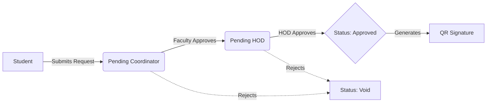

<div align="center">
  
# 🏛️ ESEC Student OD Management System

**Replacing Paper with Precision. A Zero-Trust Digital Ecosystem for Institutional Approvals.**

[](https://reactjs.org/)
[](https://www.typescriptlang.org/)
[](https://tailwindcss.com/)
[](https://supabase.com/)

[Report a Bug](https://github.com/yourusername/repo/issues) · [Request Feature](https://github.com/yourusername/repo/issues) 

</div>

---

## ⚡ The Problem vs. The Solution

For years, engineering students participating in symposiums, hackathons, and workshops had to navigate a labyrinth of physical "On-Duty" (OD) forms, chasing down signatures from multiple faculty members, often losing papers along the way.

**The ESEC OD System** completely digitizes this workflow. It is a modern, high-performance web application that brings transparency, speed, and cryptographic security to internal college approvals.

---

## 🚀 Key Features

*   🎓 **Frictionless Student Dashboard:** Mobile-optimized, ultra-fast submission forms with automated data entry and document uploading loops.
*   👨🏫 **Intelligent Role-Based Access (RBAC):** Dedicated, secure views for Students, Faculty Coordinators, Department HODs, and Super Admins.
*   🚦 **Live State Tracking:** Watch requests move from `Pending` to `Approved` in completely real-time. No more guessing.
*   📊 **Live Analytics & Auditing:** Comprehensive dashboards tracking department participation, filtering by semester, year, and event type.
*   📠 **One-Click Excel Export:** Robust data-dumping services for institutional auditing and NAAC accreditation reports.
*   🛡️ **Zero-Trust Verification:** Fully approved ODs generate a mathematically secure, tamper-proof QR code to prevent forgery at the gates.

---

## 🏗️ System Architecture & Data Flow

The application follows a strict finite state machine for approvals to prevent race conditions.



---

## 💻 Tech Stack

**Client-Side:**
- **Core:** React 18
- **Language:** TypeScript (Strict Mode)
- **Styling:** Tailwind CSS (Custom Blueprint Design System)
- **Icons:** Lucide React
- **Data Export:** XLSX

**Backend & Infrastructure:**
- **Database:** Supabase (PostgreSQL)
- **Auth:** Supabase Auth
- **Storage:** Supabase Buckets (For Proofs & Geotags)

---

## 📸 Interface Previews

> **Note to self before publishing:** *Replace these placeholder URLs with screenshots of your actual dashboards!*

| Student Dashboard | Faculty & Analytics View |
| :---: | :---: |
|  |  |

---

## 🛠️ Quick Start & Installation

To run this project locally, follow these steps:

### 1. Clone the repository
```bash
git clone https://github.com/yourusername/esec-od-system.git
cd esec-od-system
```

### 2. Install dependencies
```bash
npm install
```

### 3. Setup Environment Variables
Create a `.env` file in the root directory and add your Supabase credentials.
```env
VITE_SUPABASE_URL=your_supabase_project_url
VITE_SUPABASE_ANON_KEY=your_supabase_anon_key
```

### 4. Run the Dev Server
```bash
npm run dev
```
The system will now be running on `http://localhost:5173`.

---

## 🔒 Security Principles
This system enforces strict RLS (Row Level Security) policies on the backend database. A user's JWT token determines their clearance level, ensuring that a student can never spoof a faculty endpoint, and faculty only see data pertinent to their specific department scope.

---

<div align="center">
  <b>Architected for speed. Built for scale.</b><br>
  <i>Designed by Rahul Shyam</i> (https://www.linkedin.com/in/rahulshyamcivil/)
</div>
